PAYMENT ASSISTANT

Descripción

Imagina un asistente personal que no solo recuerda tus pagos recurrentes, sino que también los ejecuta por ti con solo confirmar un recordatorio. Con tecnología de inteligencia artificial de vanguardia, nuestra app te permite registrar y programar pagos de servicios como luz, agua, renta y más, usando simplemente tu voz. Olvídate de fechas vencidas, multas o estrés financiero. Además, con planes flexibles que se adaptan a tus necesidades, disfrutas de una experiencia gratuita para un pago mensual y opciones premium para múltiples transacciones.
Es importante recalcar que nuestro diseño de base de datos, en las tablas de usuarios, roles, permisos, transacciones y todas las demás, está inspirado en las explicaciones del profesor durante las clases, bajo el principio de siempre insertar y no actualizar.

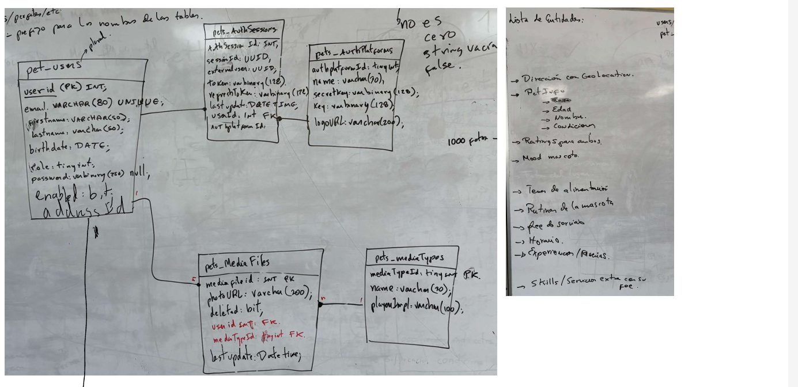
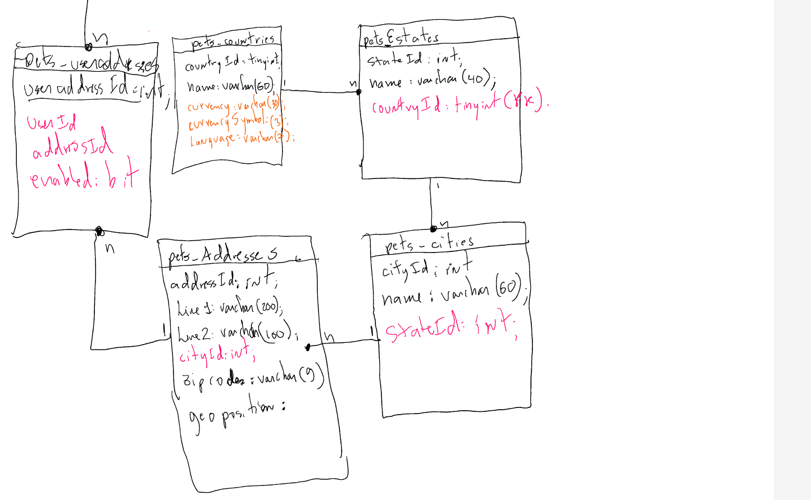
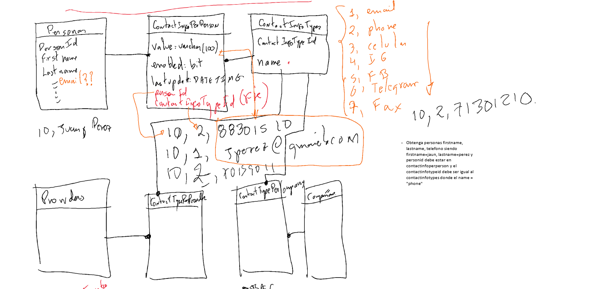
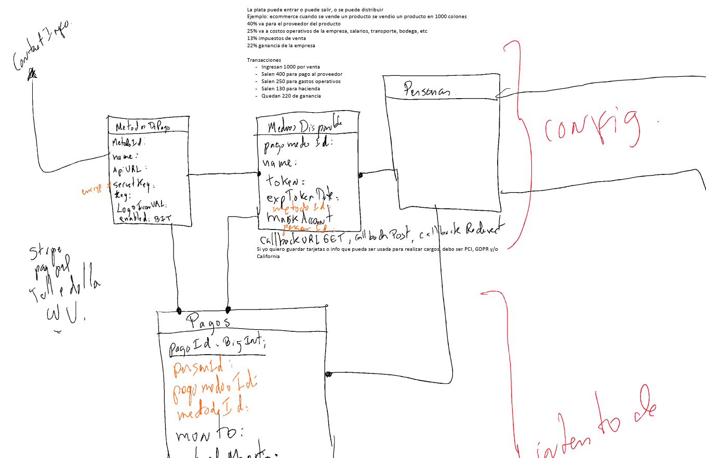
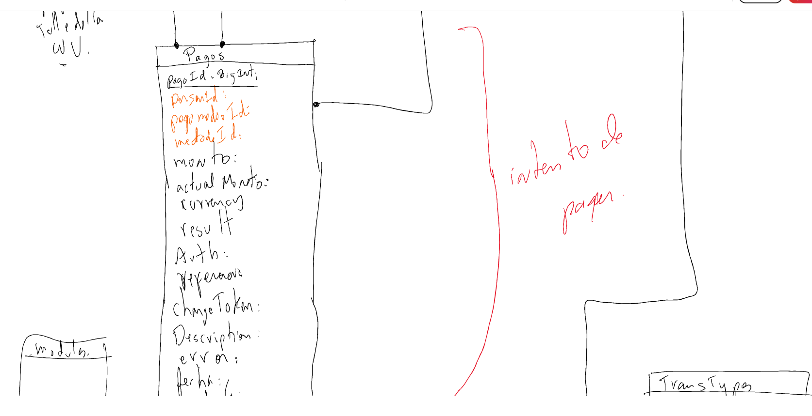
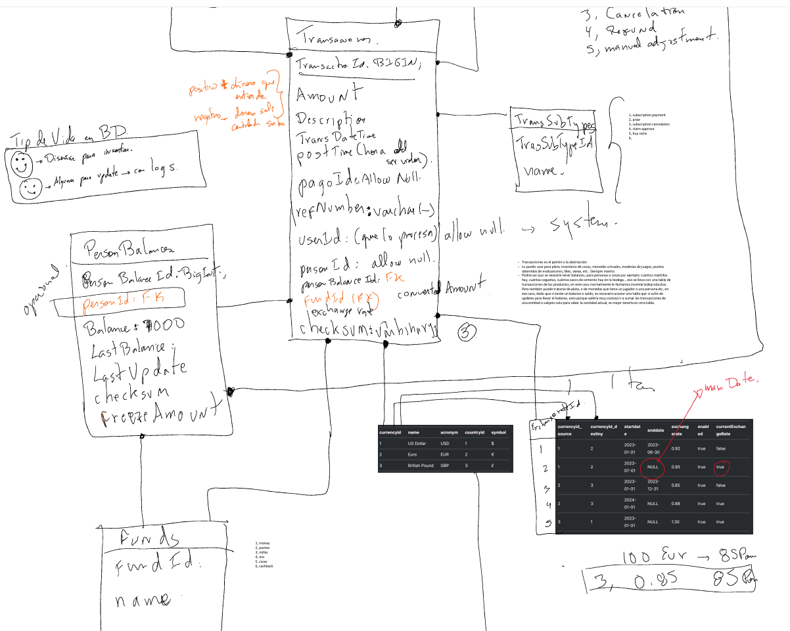
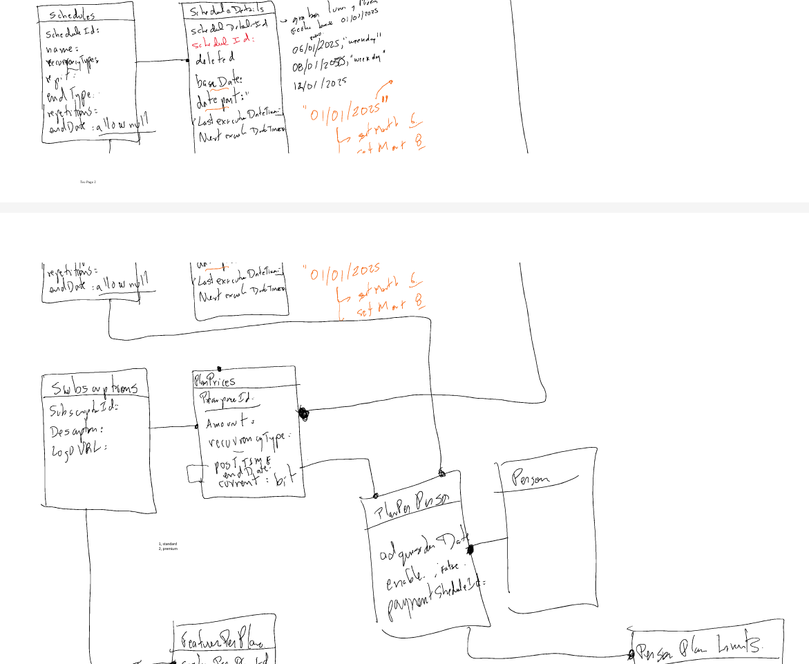

Esto reduce el riesgo de errores, además de mejorar el rendimiento del sistema.
Ahora bien, a continuación, están los requerimientos funcionales explicados, las tablas correspondientes necesarias, el por qué son importantes, y además algunos ejemplos de aplicaciones o sitios web que utilizan estos métodos:

Interacción por Voz y Registro de Pagos

Funcionalidad:

•	La aplicación permite a los usuarios registrar pagos recurrentes mediante comandos de voz.
•	Se utiliza procesamiento de lenguaje natural para identificar detalles como el servicio, monto, fecha y frecuencia.
•	Cada interacción se confirma con el usuario antes de ser almacenada.
Tablas involucradas:
•	Usuarios: Almacena la información personal y de autenticación (ID, nombre, contraseña, etc.).
•	VoiceTranscription: Guarda las transcripciones de los comandos de voz.
•	AI_Interaction: Registra cada interacción, incluyendo los comandos extraídos y las respuestas generadas.

Esta combinación permite que el sistema capture con precisión las órdenes emitidas por voz y las vincule a la identidad del usuario, facilitando el seguimiento y la mejora continua de la experiencia. Esta funcionalidad la utilizan aplicaciones como Google Assistant y Amazon Alexa para permitir a los usuarios interactuar de manera natural y sin fricciones. Los usuarios se benefician de la rapidez y facilidad de uso, reduciendo errores de entrada manual y haciendo el proceso mucho más intuitivo.

Gestión de Cuentas Bancarias y Métodos de Pago

Funcionalidad:

•	Los usuarios pueden configurar sus cuentas bancarias, registrando datos como el número de cuenta, nombre del banco y saldo.
•	La aplicación permite vincular métodos de pago (como tarjetas o transferencias) para autorizar transacciones automáticas.
•	Se pueden editar o eliminar cuentas y métodos de pago cuando sea necesario.
Tablas involucradas:
•	cuentaBancaria: Almacena información detallada de las cuentas bancarias.
•	MetodoPago: Detalla los métodos de pago, incluyendo token, fecha de expiración y otros parámetros.
•	companies: Gestiona información de empresas relacionadas o clientes corporativos.
•	ContactInfoTypes y ContactInfo: Permiten almacenar datos de contacto y otros detalles asociados a cuentas y métodos.

Estas tablas aseguran que toda la información financiera y de contacto esté correctamente vinculada a cada usuario, permitiendo transacciones seguras y verificables. Esta funcionalidad la utilizan aplicaciones como Mint para la gestión de cuentas y la monitorización de saldos. Los usuarios se benefician al tener toda su información financiera consolidada y actualizada, lo que permite transacciones seguras y verificables.

Ejecución de Pagos y Registro de Transacciones

Funcionalidad:

•	Una vez que se confirma un pago (mediante notificaciones SMS o email), la aplicación ejecuta la transacción de forma automática.
•	Se registra cada transacción, capturando datos como el monto, la fecha, el método de pago utilizado y el estado (éxito o fallo).
•	Se mantiene un historial completo para análisis y consulta futura.
Tablas involucradas:
•	Pagos: Registra cada pago realizado.
•	Transaccion: Almacena detalles ampliados de cada transacción, incluyendo referencias y estado.
•	Balances: Controla el saldo y registra los movimientos financieros asociados.
•	Notificacion: Gestiona el envío de recordatorios y confirmaciones de pago.

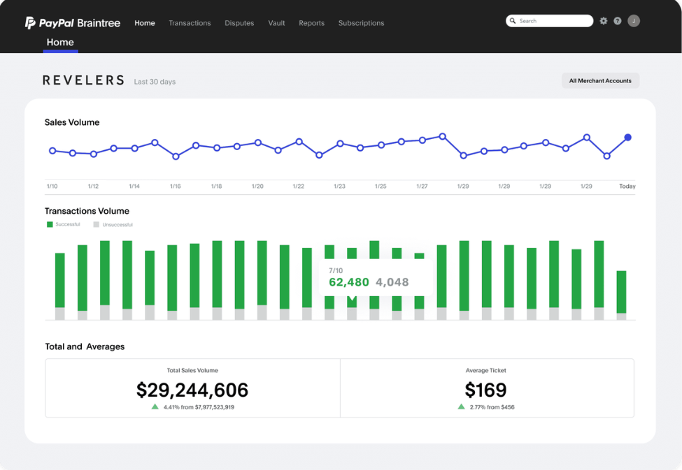

Este conjunto de tablas permite un seguimiento detallado de todas las transacciones, garantizando que cada pago se ejecute y se registre correctamente para futuros análisis y auditorías. Esta funcionalidad la utilizan aplicaciones como Braintree Payments, que ofrecen un sistema robusto para procesar pagos y mantener un historial detallado de transacciones. Los usuarios se benefician al contar con un registro transparente de sus operaciones, lo que facilita el seguimiento y la resolución de cualquier inconveniente.

Planes y Monetización

Funcionalidad:

•	La aplicación debe ofrecer una opción gratuita que permita un pago único al mes.
•	Además, se deben ofrecer planes de suscripción escalables basados en la cantidad de pagos y transferencias mensuales que el usuario requiera.
•	El sistema gestionará de forma automática la facturación y la renovación de estas suscripciones.
Tablas involucradas:
•	Suscripcion: Define los planes disponibles en la aplicación, incluyendo descripciones y otros detalles relevantes.
•	FeaturePerPlan: Especifica las características adicionales que se incluyen en cada plan, permitiendo diferenciar la oferta en función del nivel de servicio.
•	PlanPrices: Detalla el precio, la periodicidad (mensual, anual, etc.) y la vigencia de cada plan de suscripción.
•	PlanPerPerson: Relaciona el plan de suscripción con cada usuario, permitiendo saber qué plan ha seleccionado cada cliente.
•	PersonPlanLimits: Establece restricciones específicas, como la cantidad máxima de pagos o transferencias mensuales que se permiten en cada plan.

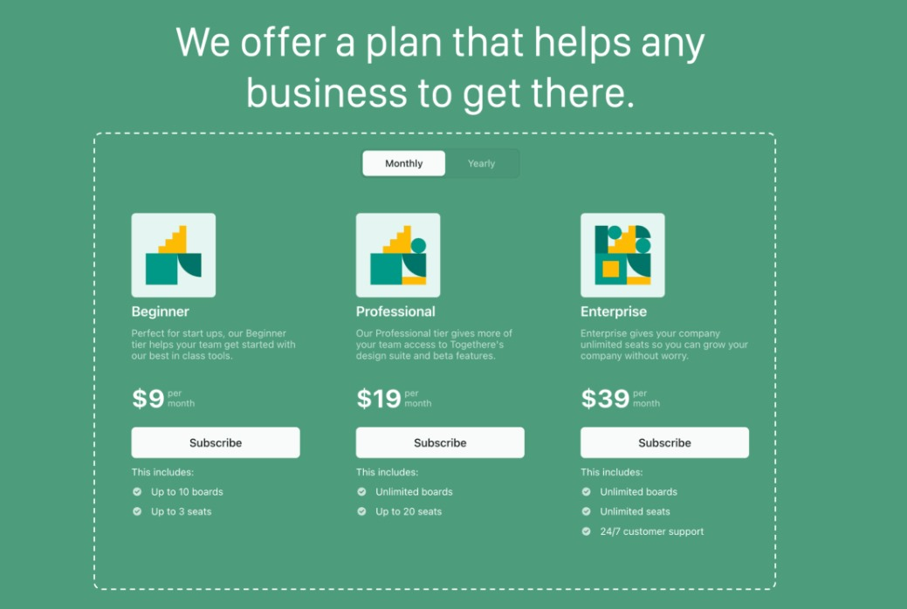

Este modelo permite gestionar de manera integral las suscripciones del usuario, garantizando que el plan gratuito se mantenga con un solo pago mensual, mientras que los planes de suscripción premium se ajustan a la cantidad de transacciones requeridas y se renuevan automáticamente, facilitando la facturación continua. Esta funcionalidad la utilizan servicios como Stripe Checkout para gestionar suscripciones y planes de precios de forma dinámica. Los usuarios se benefician de una oferta flexible que se adapta a sus necesidades, facilitando la comparación y elección de un plan que maximice su valor.

Programación y Recordatorios

Funcionalidad:

•	La aplicación programa la ejecución de pagos según la recurrencia definida (diaria, semanal, mensual, etc.) y envía recordatorios para confirmar los pagos.
•	Los recordatorios se gestionan mediante notificaciones que se envían al usuario, garantizando que no se omitan transacciones importantes.
Tablas involucradas:
•	Schedules: Configura la recurrencia y el número de repeticiones.
•	Schedule: Registra los detalles de cada ejecución programada, como la fecha base y la próxima ejecución.
•	pagoProgramado: Vincula la programación con la ejecución de pagos, relacionando montos y métodos de pago.
•	Notificacion: Gestiona el envío y registro de notificaciones y recordatorios.

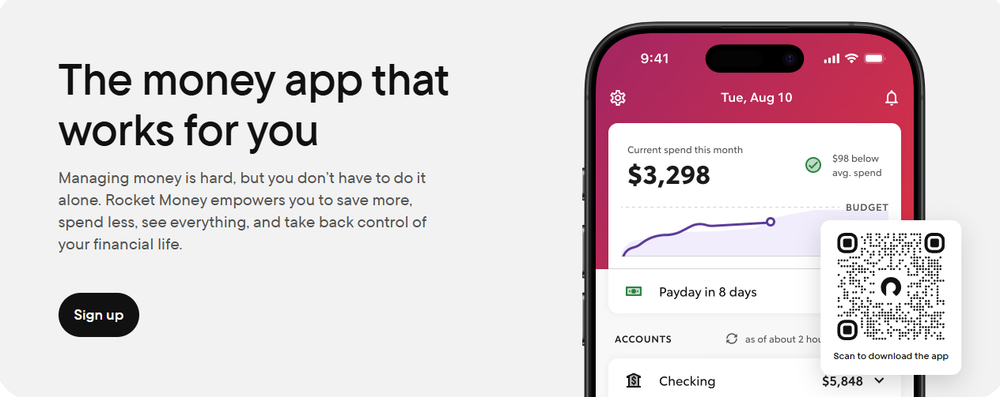

Este sistema asegura que los pagos se realicen a tiempo y que el usuario siempre reciba la información necesaria para autorizar cada transacción. Esta funcionalidad la utilizan aplicaciones como Rocket Money o Prism Bill Pay, que programan recordatorios y ayudan a gestionar las fechas de pago. Los usuarios se benefician al evitar olvidos y multas, manteniendo un flujo de pagos puntual y organizado.

Seguridad, Roles y Permisos

Funcionalidad:

•	Para proteger el sistema y la información del usuario, se implementa un robusto sistema de roles y permisos.
•	Esto define qué acciones puede realizar cada usuario y asegura que solo personal autorizado acceda a determinadas funcionalidades.
Tablas involucradas:
•	roles: Define los distintos roles dentro del sistema.
•	modulos: Organiza las funcionalidades en módulos o áreas.
•	permisos: Establece los permisos asociados a cada módulo.
•	roles_permisos: Relaciona roles con los permisos correspondientes.
•	users_roles: Asocia cada usuario a uno o varios roles.
Estas tablas forman la columna vertebral del sistema de seguridad, asegurando que el acceso a funciones críticas esté adecuadamente controlado. Esta funcionalidad la utilizan aplicaciones como Auth0 para implementar controles de acceso basados en roles (RBAC). Los usuarios y administradores se benefician al contar con un sistema que restringe el acceso a funciones sensibles, aumentando la seguridad del sistema.

Integración con APIs Externas y Gestión de Logs

Funcionalidad:

•	La aplicación se integra con APIs externas para procesar pagos y enviar SMS, lo que permite automatizar la ejecución de transacciones.
•	Además, se registra cada evento y error en un sistema de logs que facilita la auditoría y el monitoreo del sistema.
Tablas involucradas:
•	APIExterna: Configura y gestiona la conexión con APIs de terceros (definiendo endpoints, tokens, etc.).
•	Services: Lista y detalla los servicios de pago y sus parámetros.
•	LogTypes: Clasifica los tipos de logs generados.
•	LogSources: Registra la fuente de cada evento o error.
•	LogSeverity: Define la gravedad de los logs.
•	Logs: Almacena el registro completo de eventos y errores para auditoría.

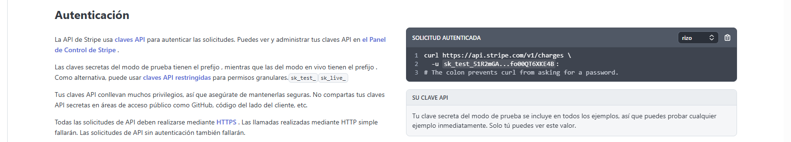

Estas tablas aseguran que la integración externa y el registro de actividades se realicen de forma transparente y eficiente. Esta funcionalidad la utilizan aplicaciones como Stripe y Twilio para integrar pagos y envíos de SMS, mientras que plataformas como Datadog y Splunk gestionan los logs y eventos del sistema. Los usuarios se benefician al contar con procesos automatizados y un sistema de monitoreo que garantiza la estabilidad y la seguridad del servicio.

Soporte Internacional y Datos Complementarios

Funcionalidad:

•	Para adaptarse a un mercado global, Payment Assistant incorpora soporte para diferentes monedas, tasas de cambio, idiomas y países.
•	Esto permite que la aplicación ajuste los formatos, precios y la experiencia de usuario de acuerdo con la región.
Tablas involucradas:
•	Moneda: Define las monedas utilizadas en el sistema.
•	tasaCambio: Registra las tasas de cambio entre las diferentes monedas.
•	TranslationLanguage: Almacena información sobre idiomas para la localización.
•	Countries: Relaciona países con la moneda y el idioma correspondiente.
•	companies: Gestiona información de empresas relacionadas, ya sean clientes o entidades colaboradoras.

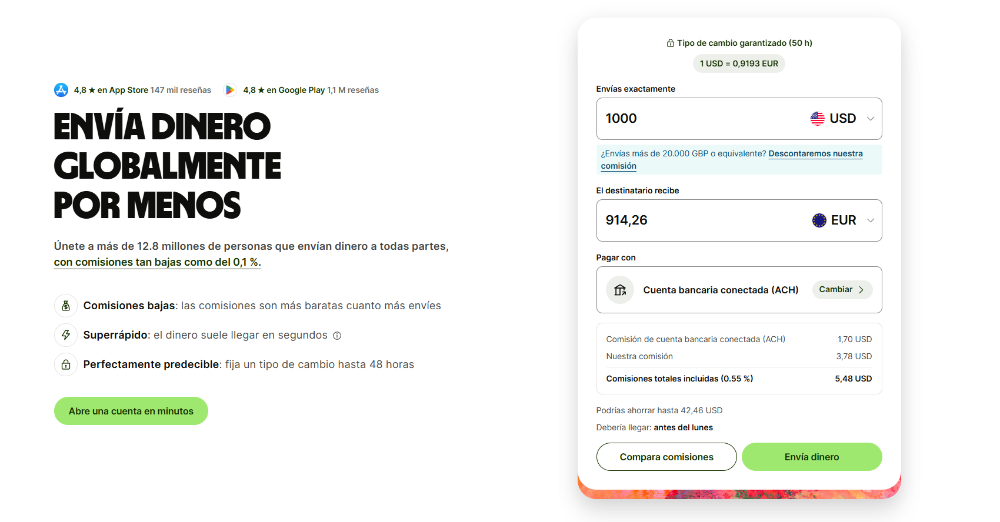

Estas tablas complementarias permiten que la aplicación opere de forma personalizada y escalable en diferentes mercados internacionales. Esta funcionalidad la utilizan aplicaciones como Revolut y Wise, que gestionan múltiples monedas y ofrecen tasas de cambio en tiempo real. Los usuarios se benefician de una plataforma que les permite operar en su moneda local y recibir información adaptada a su región, lo que mejora la experiencia global del servicio.

Otros Datos Complementarios

Funcionalidad:

•	Algunas tablas adicionales aseguran una clasificación más fina de las transacciones y facilitan el análisis de datos.
Tablas involucradas:
•	TransSubTypes: Clasifica subtipos de transacciones para un análisis más detallado.
•	TransType: Registra los tipos generales de transacciones que se pueden realizar.
•	VoiceTranscription: Además de lo mencionado, refuerza el análisis de los comandos de voz para futuras mejoras.

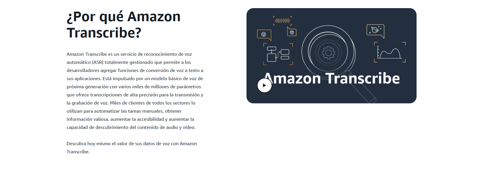

Esta funcionalidad es crucial para sistemas financieros que requieren un análisis detallado y categorización precisa de cada transacción. Empresas de análisis de datos y auditoría financiera utilizan esta aproximación para identificar patrones, optimizar procesos y mejorar la precisión en la gestión de transacciones
